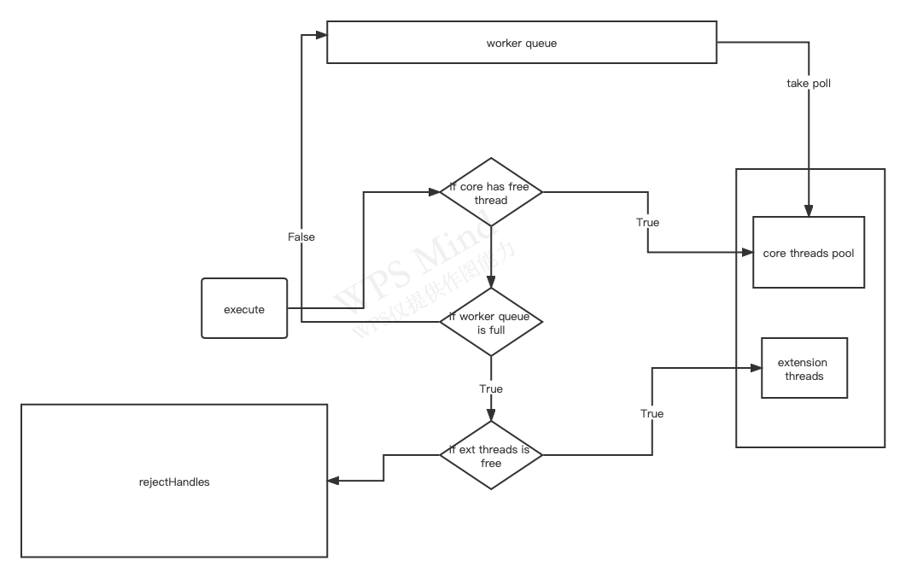

```
不停的创建线程非常消耗资源(linux 对进程拷贝 并且会对一块内存映射为共享内存)
```
## 将task提交跟线程池后线程池处理流程

```
1.核心线程池里面的线程是否都在执行任务
   false:创建新线程执行任务
2.工作队列是否已经满了
     false 添加到工作队列 
3.线程池里面里面的所有线程是否都在执行任务
   否：创建新线程
   是: 交给策略来处理

为什么大于corePoolSize要加入blockingQueue,部直接创建thread,
  尽可能避免使用全局锁

```
## 线程执行任务分两种情况
```
execute()
1.创建线程直接执行
2.获取blockingQueue 队列的Task执行线程

```


```
COUNT_BITS = Integer.SIZE - 3;//32-3=29
CAPACITY   = (1 << COUNT_BITS) - 1;//  00001111 11111111 11111111 11111111
   10000 00000000 00000000 00000000 -1                                    

RUNNING    = -1 << COUNT_BITS;// 11100000 00000000 00000000 00000000

SHUTDOWN  =0 << COUNT_BITS;// 00000000 00000000 00000000 00000000
STOP       =  1 << COUNT_BITS;  // 00010000 00000000 00000000 00000000

TIDYING    =  2 << COUNT_BITS;//00100000 00000000 00000000 00000000
TERMINATED =  3 << COUNT_BITS;01100000 00000000 00000000 00000000

    // Packing and unpacking ctl
~CAPACITY;//11110000 00000000 00000000 00000000 
    private static int runStateOf(int c)     { return c & ~CAPACITY; }
    private static int workerCountOf(int c)  { return c & CAPACITY; }


RUNNING    = -1 << COUNT_BITS;// 11100000 00000000 00000000 00000000
 private final AtomicInteger ctl = new AtomicInteger(ctlOf(RUNNING, 0));
private static int ctlOf(int rs, int wc) { return rs | wc; }
ctl=      11100000 00000000 00000000 00000000
CAPACITY= 00001111 11111111 11111111 11111111

ctr+1=11100000 00000000 00000000 00000001
      00001111 11111111 11111111 11111111

```

## c<corePoolSize()
```
    int c = ctl.get();
        if (workerCountOf(c) < corePoolSize) {//检测工作线程的数量是否小于核心线程数(核心线程数<CAPACITY)
            if (addWorker(command, true))
                return;
            c = ctl.get();
        }
```


## 线程池的创建
```
        ThreadPoolExecutor threadPoolExecutor = new ThreadPoolExecutor(1, 2,
                0, TimeUnit.MINUTES, blockingQueue, new ThreadFactory() {
            private final AtomicInteger atomicInteger = new AtomicInteger(0);

            @Override
            public Thread newThread(Runnable r) {
                Thread thread = new Thread(r);
                thread.setName("excutor-index: " + atomicInteger.incrementAndGet());
                return thread;
            }
        });


参数
int corePoolSize,
  exectute() 只要 线程数小于 corePoolSize 就会创建线程
  prestartAllCoreThreads() 提前开启所有核心线程
  prestartCoreThread 提前启动一个核心线程


int maximumPoolSize,
  队列满了, 创建线程(当前池子里面的线程数必须小于maximumPoolSize)
long keepAliveTime,
        线程池工作线程空闲后 存活时间
TimeUnit unit,


BlockingQueue<Runnable> workQueue,
   ArrayBlockingQueue  
   LinkedBlockingQueue newFixedThreadPool() 使用的是这个 吞吐量比ArrayBlockingQueue高
   SynchronousQueue 只能添加一个 必须等待移除才能添加第二个 Executors.newCachedThreadPool


ThreadFactory threadFactory,

RejectedExecutionHandler handler

```


## 向线程池提交任务
```
submit 有返回值
execute

```
## 关闭
```
便利线程池 逐个惊醒 interrup他中断
threadPoolExecutor.shutdown();
threadPoolExecutor.shutdownNow();
    将线程池状态设置为advanceRunState(STOP); STOP
     interruptWorkers(); 对线程 interrupt 中断
      tryTerminate(); 尝试停止所有线程 
      返回所有等待执行列表


threadPoolExecutor.shutdown();(优雅关闭)
 advanceRunState(SHUTDOWN);
 interruptIdleWorkers();  对Idle 状态的线程 interrupt
tryTerminate();


threadPoolExecutor.isShutdown();
当执行上面方法的其中一个调用它都会返回 true

真正所有线程都都结束
 threadPoolExecutor.isTerminated(); true

正在进行关闭操作
hreadPoolExecutor.isTerminating()
(!isRunning)&& !isTermimated() 才是正在进行关闭操作
```
## 合理配置线程池
```
任务分析
1.判断任何类型
  IO密集型  or CPU 密集型
CPU:线程尽可能小 N(cpu)+1  例 12(cpu核心数可执行线程)+1-----执行快速,切换频繁,很少等待
IO 2*N(cpu) IO并一种在执行他会进行等待

     Runtime.getRuntime().availableProcessors(); 当前设备CPU数

2.判断每个任务执行的事件长短

3.任务依赖关系(如访问DataBase)
  访问数据库 会等待响应 这样事件会比较长 应该使用较大的线程数 

PriorityBlockingQueue 当优先级高的提交的队列 优先级低的永远都不能执行

suggest：建议使用有界队列
    
```
## 线程池的监控
```
        LinkedBlockingQueue<Runnable> blockingQueue = new LinkedBlockingQueue<>(1);
        ThreadPoolExecutor threadPoolExecutor = new ThreadPoolExecutor(1, 2,
                0, TimeUnit.MINUTES, blockingQueue, new ThreadFactory() {
            private final AtomicInteger atomicInteger = new AtomicInteger(0);

            @Override
            public Thread newThread(Runnable r) {
                Thread thread = new Thread(r);
                thread.setName("excutor-index: " + atomicInteger.incrementAndGet());
                System.out.println(thread.getName());
                return thread;
            }
        }) {
            @Override
            protected void beforeExecute(Thread t, Runnable r) {
                super.beforeExecute(t, r);//执行之前 
            }

            @Override
            protected void afterExecute(Runnable r, Throwable t) {
                super.afterExecute(r, t);//任务执行之后
            }

            @Override
            protected void terminated() {
                super.terminated();//任务执行结束
            }
        };
```